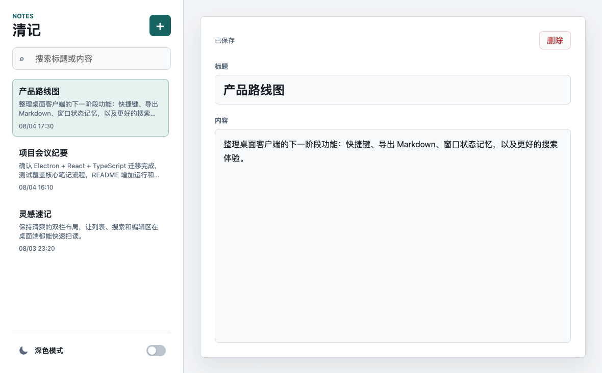

# 清记桌面客户端

清记是一个基于 Electron + React + TypeScript 的本地笔记桌面应用。应用提供双栏笔记管理界面，支持新建、编辑、删除、搜索、自动保存和深浅主题切换，数据保存在当前系统的 Electron 用户数据目录中。

## 软件界面



## 功能特性

- 本地笔记管理：创建、编辑、删除笔记。
- 自动保存：标题和正文输入后自动写入本地 JSON 数据文件。
- 搜索过滤：按标题和正文内容实时搜索，大小写不敏感。
- 主题切换：支持浅色和深色模式，并持久化主题偏好。
- 桌面隔离：渲染进程不直接访问 Node API，通过 Electron preload 暴露最小桥接接口。
- 启动保护：preload 或桌面桥接异常时显示诊断信息，避免空白页。

## 技术栈

- Electron 33
- React 18
- TypeScript 5
- Vite 6
- Vitest
- Testing Library
- electron-builder

## 目录结构

```text
.
├── electron/
│   ├── main.ts          # Electron 主进程，创建窗口并注册 IPC
│   └── preload.cjs      # preload 桥接，向渲染进程暴露 window.qingji
├── scripts/
│   └── copy-preload.mjs # 构建时复制 CommonJS preload 到 dist-electron
├── src/
│   ├── renderer/        # React 渲染进程
│   └── shared/          # 笔记模型、业务逻辑和文件存储
├── test/                # 单元测试和组件测试
├── index.html           # Vite 渲染入口
├── styles.css           # 应用样式
└── package.json         # 脚本、依赖和 electron-builder 配置
```

## 环境要求

- Node.js 20 或更高版本。
- npm。
- macOS 可直接运行当前开发环境；Electron 配置保持跨平台兼容。

如果本机 Electron binary 没有安装完整，`npm run dev` 可能会报 `Electron failed to install correctly`。处理方式见下方“Electron 下载排障”。

## 安装依赖

```bash
npm install
```

如果网络下载 Electron 很慢，可以先跳过 Electron binary 下载，仅安装普通依赖：

```bash
ELECTRON_SKIP_BINARY_DOWNLOAD=1 npm install
```

跳过后可以运行测试和构建，但不能启动 Electron 窗口，仍需按“Electron 下载排障”补齐 binary。

## 开发运行

```bash
npm run dev
```

该命令会先构建 Electron 主进程和 preload，然后并行启动：

- Vite dev server：`http://127.0.0.1:5173/`
- Electron 桌面窗口

不要直接打开根目录的 `index.html` 使用应用。它是源码入口，直接用 `file://` 打开时浏览器不会编译 TSX，只会显示启动说明。开发时请使用 `npm run dev`。

## 测试

```bash
npm test
```

测试覆盖：

- 笔记创建、更新、删除、排序和搜索。
- 空标题、空内容 fallback 文案。
- 无效持久化数据回退到欢迎笔记。
- 文件存储读写和损坏 JSON 回退。
- React 组件加载、编辑、搜索、删除、主题切换。
- Electron 桥接缺失时显示启动错误页。

## 构建

```bash
npm run build
```

构建流程：

1. TypeScript 检查渲染进程和测试相关类型。
2. Vite 构建 React 渲染资源到 `dist/`。
3. TypeScript 编译 Electron 主进程到 `dist-electron/`。
4. 复制 `electron/preload.cjs` 到 `dist-electron/electron/preload.cjs`。

## 打包

```bash
npm run package
```

当前打包脚本使用 `electron-builder --dir`，会在 `release/` 下生成未压缩的桌面应用目录。正式分发前可以按目标平台继续扩展 `package.json` 中的 `build` 配置。

## 数据存储

应用数据保存在 Electron 的 `app.getPath("userData")` 目录下，文件名为：

```text
qingji-data.json
```

数据结构包含：

- `notes`：笔记列表。
- `theme`：当前主题，取值为 `light` 或 `dark`。

读取失败、文件缺失或 JSON 损坏时，应用会使用默认欢迎笔记和浅色主题启动。

## Electron 下载排障

如果执行 `npm rebuild electron` 或 `npm install` 时出现超时，例如：

```text
RequestError: read ETIMEDOUT
```

可以手动下载 Electron binary 到项目缓存目录。Apple Silicon Mac 使用：

```bash
mkdir -p .electron-cache
curl -L --retry 10 --retry-delay 5 --connect-timeout 30 -C - \
  -o .electron-cache/electron-v33.4.11-darwin-arm64.zip \
  https://cdn.npmmirror.com/binaries/electron/33.4.11/electron-v33.4.11-darwin-arm64.zip
```

校验 zip：

```bash
unzip -tq .electron-cache/electron-v33.4.11-darwin-arm64.zip
```

如果 `npm rebuild electron` 仍然卡住，可以手动安装：

```bash
rm -rf node_modules/electron/dist
mkdir -p node_modules/electron/dist
ditto -x -k .electron-cache/electron-v33.4.11-darwin-arm64.zip node_modules/electron/dist
printf 'Electron.app/Contents/MacOS/Electron' > node_modules/electron/path.txt
codesign --force --deep --sign - node_modules/electron/dist/Electron.app
```

验证：

```bash
npm exec electron -- --version
```

输出 `v33.4.11` 表示 Electron binary 可用。

## 常见问题

### 打开根目录 index.html 是空白或只显示说明

这是正常的源码入口行为。请使用：

```bash
npm run dev
```

### Electron 窗口空白

优先确认：

```bash
npm run build
npm run dev
```

当前 dev server 固定使用 `127.0.0.1:5173`，避免 `localhost` 解析到 IPv6 导致 Electron 加载失败。若仍空白，窗口中应该显示桥接诊断信息；如果没有，请检查终端输出和 `dist-electron/electron/preload.cjs` 是否存在。

### 端口 5173 被占用

查找占用进程：

```bash
lsof -nP -iTCP:5173 -sTCP:LISTEN
```

结束确认无用的进程后重新运行：

```bash
npm run dev
```

## 开发约定

- 修改代码后运行 `npm test` 和 `npm run build`。
- 本仓库要求每次完成代码修改后创建一次 git commit。
- 不提交 `node_modules/`、`.electron-cache/`、`dist/`、`dist-electron/`、`release/` 等本地生成物。
